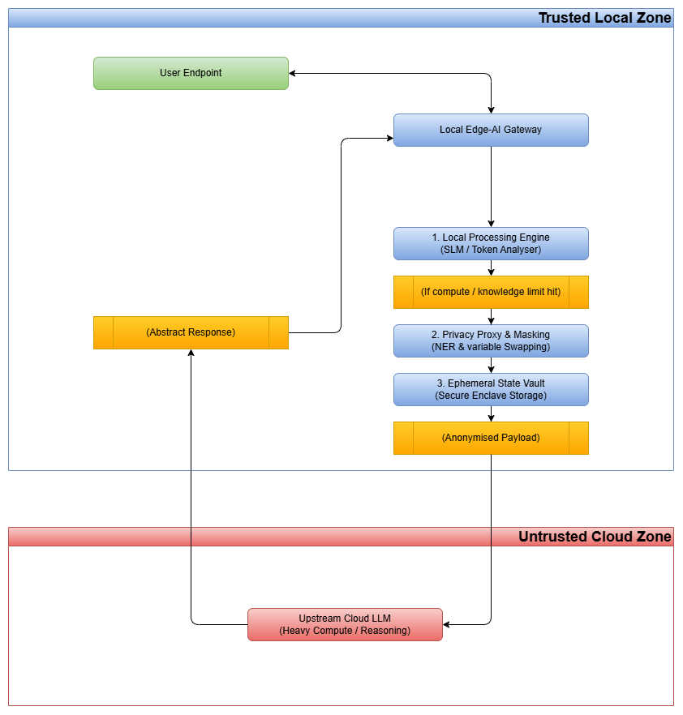

The Hybrid Edge-AI Gateway Architecture

**Securing Enterprise Data Sovereignty in the Era of Infinite Compute**

Copyright © 2026 Richard Amies.  
LinkedIn: [https://www.linkedin.com/in/rich-amies-b63a25201/](https://www.linkedin.com/in/rich-amies-b63a25201/)

This work may be referenced, shared, or built upon for non‑commercial purposes, provided clear attribution to the original author is maintained.

10th August 2026

# Foreword

This work began during a period between roles, when I set out to deepen my understanding of emerging AI systems and the practical realities of working with Large and Small Language Models.  What started as routine experimentation quickly revealed behaviours that were both unexpected and concerning.  In controlled testing, I observed a small model leak fragments of training artefacts, misinterpret user intent, and produce responses that clearly fell outside safe operational boundaries.  These incidents raised a simple but important question: ***what are we actually trusting when we rely on these systems?***

The more I explored, the more I realised the issue was not limited to model behaviour.  It extended to the entire ecosystem surrounding AI adoption: how much sensitive information users unknowingly provide, where that data travels, how long it persists, and whether organisations can meaningfully enforce sovereignty over it.  The convenience of cloud-scale inference often masks the fact that prompts may cross borders, enter opaque processing pipelines, or become part of long-term storage systems beyond enterprise control.

These observations led me to step back from individual model quirks and examine the architectural foundations underpinning them.  If AI is to be integrated safely into enterprise environments, we need structures that enforce privacy, constrain exposure, and provide deterministic guarantees about *what* leaves the perimeter – and *what never* should.

The Hybrid Edge-AI Gateway Architecture (HEAGA) is the result of that investigation.  It is not a theoretical exercise, but a response to real behaviours, real risks, and structural gaps in current AI deployment models.  My aim is to provide a framework that helps organisations benefit from advanced reasoning systems without surrendering control of their data, their sovereignty, or their security posture.

# Executive Summary

The rapid integration of Large Language Models (LLMs) into enterprise workflows has created a fundamental conflict between operational velocity, compute economics, and regulatory compliance.  Centralised public cloud LLMs offer unprecedented reasoning capabilities but demand a level of data exposure that violates emerging global data sovereignty mandates, trade secret protections, and strict privacy laws like GDPR and HIPAA.  Conversely, deploying localised Small Language Models (SLMs) on enterprise edge hardware mitigates data leak vectors but severely restricts computational performance, contextual memory depth, and real-time knowledge availability.

This paper presents the Hybrid Edge-AI Gateway Architecture (HEAGA) – a dual-layer framework that resolves this friction.  HEAGA positions an intelligent, local AI gateway at the enterprise boundary.  This local node serves as the primary port of call, processing routine, localised queries on edge hardware.  When a request exceeds local VRAM capacity, contextual confidence thresholds, or historical knowledge banks, the gateway dynamically orchestrates an upstream cloud offload.

Crucially, the gateway acts as a Privacy Proxy, executing local Named Entity Recognition (NER), structural tokenisation, and context-masking to fully anonymise the data footprint before it exits the perimeter.  The external cloud processes an abstract, generic payload and returns a sanitised reasoning structure.  The local gateway then leverages an isolated, ephemeral state table to rehydrate the response with the original sensitive identifiers.

Finally, this paper maps the unique threat vectors introduced by this model – specifically Reverse Semantic Engineering and Token State-Table Hijacking – and establishes the cryptographic, structural, and behavioural engineering countermeasures required to defend the perimeter.

HEAGA provides a deterministic, enforceable boundary that aligns AI adoption with emerging sovereignty and regulatory mandates.

# Why This Matters, and Why Now (2026)

The pace of AI adoption has accelerated far beyond the maturity of the controls that govern it. Organisations are integrating Large Language Models into critical workflows, replacing human judgement with automated reasoning systems that operate across borders, across vendors, and across opaque inference pipelines.  In doing so, enterprises are unknowingly exposing vast amounts of sensitive information – not through malicious intent, but through routine usage.

**Every prompt is a disclosure.**

**Every interaction is a data transfer.**

**Every convenience carries an implicit cost.**

The challenge is not that AI is inherently unsafe; it is that the surrounding infrastructure was never designed for the volume, sensitivity, or strategic value of the information now flowing through it.  Corporate source code, customer records, financial models, internal strategy documents, and operational telemetry are *routinely* fed into systems whose storage, retention, and training boundaries are not fully understood.

This matters now because the external environment has shifted:

- **Data sovereignty laws are tightening**, and cross-border inference is becoming a compliance risk rather than a technical choice.

- **Cloud inference pipelines are expanding**, often without deterministic guarantees about retention, replication, or downstream training exposure.

- **AI misuse vectors are evolving**, from prompt injection to semantic leakage to indirect re-identification attacks.

- **Quantum-resilient security models are not yet deployed**, raising long-term concerns about the confidentiality of data already transmitted.

- **Enterprises are replacing human roles with AI systems**, increasing the volume and sensitivity of the information being shared.

We cannot foresee every failure mode, but we can foresee enough to say with confidence that the crown jewels of an organisation – its proprietary data, its intellectual property, its customer trust – should not be routinely transmitted to external processors without strict architectural safeguards.

The Hybrid Edge-AI Gateway Architecture exists because the industry can no longer rely on hope, habit, or convenience.  It provides a structured, enforceable boundary that allows organisations to benefit from advanced reasoning systems whilst retaining control over the information that defines them.

# 1. Introduction: The Crisis of Centralised AI and Data Sovereignty

## 1.1 The Shift in Corporate Data Governance

The initial enterprise rush to adopt commercial LLMs via public APIs has triggered a severe regulatory backlash.  Governments globally have moved from passive observation to aggressive enforcement of data localisation and AI risk management frameworks.  Organisations now operate under a zero-trust mandate for third-party cloud processors, driven by several compounding market shifts:

- **Absolute Cross-Border Restrictions:** The enforcement of strict data localisation principles means that passing telemetry, customer interactions, or source code across geographic or geopolitical jurisdictions represents an immediate, high-severity compliance breach.

- **The Sovereign Event Catalyst:** High-profile intellectual property exposures – such as proprietary software code or corporate strategy outlines indexed into public training sets – have shifted executive appetite away from unmanaged API endpoints.

- **The Failure of Passive Auditing:** Traditional Cloud Access Security Brokers (CASBs) and Data Loss Prevention (DLP) engines are fundamentally unsuited for generative AI.  They lack the semantic awareness to inspect complex user prompts, resulting in either high false-positive rates that halt productivity or total failures to block hidden, multi-layered data leaks.

## 1.2 The Edge Compute Bottleneck

To bypass cloud security risks, many enterprises have attempted to deploy localised open-source SLMs (ranging from 7B to 70B parameters) directly onto on-premise hardware or endpoint devices.  While this completely solves the data egress problem, it exposes critical operational bottlenecks:

- **The Compute Ceiling:** Edge devices, local server nodes, and network switches possess hard physical limits on volatile memory (VRAM) and tensor processing units.  Massive concurrent queries quickly exhaust local resources, causing sharp latency degradation or outright system denials.

- **The Context and Knowledge Deficit:** Complex analytical reasoning, cross-domain problem solving, and highly current real-time data lookups cannot be reliably executed by lightweight local models.  SLMs hit an absolute wall when an enterprise query demands deep, historical cross-referencing or massive context windows.

## 1.3 The Hybrid AI Thesis

The enterprise requires an architecture that treats compute as a flexible utility while treating data privacy as an unyielding constraint.  The Hybrid Edge-AI Gateway Architecture bridges this divide. It treats the local edge model not as a static, isolated processing unit, but as an intelligent, self-aware routing proxy.  By executing localisation where possible and anonymised offloading where necessary, this model maximises resource allocation without relinquishing custody of corporate intellectual property or personal data.

# 2. Architectural Blueprint: The Dual-Layer Ecosystem

The Hybrid Edge-AI Gateway Architecture splits the AI processing pipeline into two completely isolated environments: the Trusted Local Zone and the Untrusted Cloud Zone.  The gateway node stands as the single, authenticated point of transit between these layers.

## 2.1 The Trusted Local Zone (The Gateway Node)

The Trusted Local Zone comprises the enterprise network perimeter and hardened endpoint environments.  The core engine is the Local Edge-AI Gateway, deployed on secure local infrastructure.  This node consists of three primary functional sub-layers:

1. The Orchestration and Routing Layer: Analyses incoming user prompts, evaluates available local compute resources, measures model confidence scores, and determines whether the request must be offloaded upstream.

2. The Local Inference Engine: Runs localised, highly optimised SLMs tailored for specific corporate domains (e.g. code autocompletion, administrative formatting, basic internal query resolution).

3. The Privacy Proxy and State Table: Executes deep inspection, named entity parsing, payload transformation, and cryptographic isolation of variables prior to any cloud egress.

This boundary represents the enterprise’s final point of control before any anonymised offload occurs.

## 2.2 The Untrusted Cloud Zone (The Remote Processor)

The Untrusted Cloud Zone refers to any external, third-party managed infrastructure.  This includes public LLM providers, hyperscaler AI platforms, or specialised cloud model endpoints.

- This layer is treated as fundamentally untrusted from a data sovereignty perspective.

- It must never receive raw corporate identities, real network topologies, unencrypted database schemas, PII, or raw proprietary source code.

- Its sole function is to act as a raw, abstract reasoning engine, consuming heavily masked payloads and returning generalised logical templates.

# 3. The Offloading Pipeline: Operational Workflow and Mechanics

- The efficiency of this architecture relies on a highly structured, repeatable workflow that manages data states dynamically.  When a user submits a query, the system follows a precise five-stage execution path.

## 3.1 Stage 1: Ingestion and Capability Assessment

The user submits a prompt to the local workspace application.  The Local Edge-AI Gateway intercepts the prompt.  The routing layer instantly evaluates the query against three distinct Offload Triggers:

- Hardware Capacity Target: The system polls current VRAM allocation, queue density, and token throughput speed on local hardware.  If processing the request locally would cause a latency timeout or thread exhaustion, an offload is forced.

- Semantic Confidence Threshold: The local model executes a rapid, low-temperature evaluation pass on the prompt.  If the local model's confidence or semantic probability score for generating an accurate response falls below a predefined threshold (e.g., 80%), it flags a knowledge deficiency.

- Context Depth Analysis: If the query requires cross-referencing a document or log corpus that exceeds the local model’s token window, the request is routed for upstream offloading.

## 3.2 Stage 2: Named Entity Recognition and Tokenisation

If an offload trigger is pulled, the prompt enters the Privacy Proxy pipeline.  The gateway prevents the raw string from leaving the perimeter and feeds it into a specialised local Named Entity Recognition (NER) and regex engine.  This pipeline breaks down the request to find and isolate key entities:

- Explicit Identity Tokens: Corporate names, individual names, email addresses, geographic locations, and asset identifiers.

- Technical Infrastructure Descriptors: IP addresses, MAC addresses, hostnames, cluster names, internal routing paths, and database schema keys.

- Proprietary Content Blocks: Algorithmic logic sequences, financial metrics, trade secret phrases, and unreleased product naming conventions.

## 3.3 Stage 3: Payload Masking and State Construction

Once the sensitive entities are flagged, the gateway executes a destructive transformation on the payload text.  It dynamically generates a unique transaction session ID and constructs an isolated mapping matrix.

The real identifiers are scrubbed and replaced with deterministic, structurally valid placeholders.  For example:

- Acme Logistics MegaBank Corp becomes \[COMPANY\_A\]

- 10.142.55.12 becomes \[IP\_ADDRESS\_1\]

- FinCore\_Transaction\_DB becomes \[DATABASE\_X\]

Simultaneously, the gateway records these exact mappings into a highly secure, local database called the Token State Vault.  This table is stored exclusively within volatile local memory and bound strictly to the current session hash.

## 3.4 Stage 4: Upstream Processing

The gateway encapsulates the heavily masked text into an encrypted API payload and transmits it across the internet to the cloud LLM provider.

The cloud model processes the request.  Because the structural syntax, relational connections, and grammar remain perfectly intact, the cloud model can apply its massive scale and reasoning capability to solve the abstract problem.  It generates a response using the exact placeholder tokens provided in the prompt (e.g. instructing how to fix a loop vulnerability referencing \[DATABASE\_X\] or explaining an architectural optimisation for \[COMPANY\_A\]).

## 3.5 Stage 5: Local Response Rehydration

The cloud LLM returns the abstract response to the local gateway over a TLS-encrypted channel.  The gateway catches the incoming payload, validates the session token, and prevents the response from being exposed directly to the user endpoint.

The gateway accesses the corresponding entry within the Token State Vault. It scans the incoming response for the placeholder tokens, executes an exact inverse-substitution pass, and swaps the true identifiers back into the text.  The fully rehydrated, highly accurate text is then rendered securely to the user endpoint.  To the end user, the operation appears completely seamless and hyper-contextualised.  To the upstream cloud vendor, the query appeared as an entirely anonymous, abstract computing puzzle.

# 4. Deep-Dive Threat Modelling: Vulnerabilities of the Hybrid Model

While the HEAGA framework effectively neutralises direct, unencrypted data exfiltration vectors, it is not an architectural silver bullet.  Moving the data-isolation boundary to the edge creates novel attack surfaces. Security architects must anticipate two primary advanced threat vectors.

## 4.1 Reverse Semantic Engineering (RSE)

## 4.1.1 The Mechanics of Contextual Leakage

The core vulnerability of any anonymisation proxy is that context carries structural meaning, and meaning can be fingerprinted and correlated.  Large Language Models are inherently pattern-matching systems.  Stripping explicit nouns (such as names or IP addresses) does not strip the unique underlying relationships between variables.

Consider an enterprise query originating from a highly specialised financial organisation.  The proxy masks the company name as \[COMPANY\_A\] and its proprietary trading framework as \[ALGORITHM\_Y\].  However, the prompt includes a highly detailed stack trace, unique error logging outputs, and exact mathematical variables used to troubleshoot a memory leak.

An upstream attacker – whether a rogue cloud vendor employee, a compromised model node, or an adversary with passive access to the cloud provider's inference cache – can easily execute an RSE Attack.  By extracting the unique behavioural patterns, architectural structures, and domain-specific vocabulary from the abstract payload, the attacker can cross-reference the text with public open-source repositories, past credential dumps, or commercial corporate registries. The specific context acts as a fingerprint, effectively identifying the enterprise source despite the masking layer.

![[Reverse Semantic Engineering.drawio.png]]

## 4.1.2 Indirect Prompt Injection Exploitation

An insider threat or a compromised local endpoint can actively craft malicious queries designed to bypass the local proxy's filtering engine entirely.  By utilising complex linguistic obfuscation, metaphors, or base64 logical decoding structures, the user can ensure that the local proxy’s deterministic NER engine misses sensitive text patterns.

Once the prompt bypasses the proxy and reaches the advanced reasoning layers of the upstream cloud model, the cloud model easily decodes the obfuscation, processes the sensitive request, and returns an unmasked, highly compromising response that circumvents corporate policy.

## 4.2 Local Token State Vault Hijacking

The Token State Vault is the critical operational hub of the architecture; it maps abstract placeholders directly to raw corporate secrets. It represents a single point of absolute failure if compromised.

## 4.2.1 Volatile Memory Scraping

If an adversary compromises a local endpoint or gains a foothold on the server hosting the edge gateway via a local code execution vulnerability, they do not need to attempt the highly complex task of intercepting TLS-encrypted network traffic.  Instead, they can run automated volatile memory scanners.  By targeting the RAM space allocated to the gateway process, they can execute memory dumps to extract the plaintext mapping tables, instantly pairing corporate assets with their corresponding cloud session IDs.

## 4.2.2 Session Race Conditions and Token Swapping

During high-volume periods, the local gateway may process thousands of token lookups per second.  If the session state management engine utilises weak, linear, or predictable tracking values (e.g., sequential integer IDs), the architecture becomes vulnerable to session hijacking and race condition exploits.

An attacker who has gained a persistent foothold within the upstream cloud network could actively inject latency or manipulate network packet headers for returning API responses.  By slightly shifting response timings or spoofing transaction keys, they can induce a State Mapping Mismatch.  This forces the local gateway to rehydrate the response using the wrong mapping index.  As a direct consequence, Company A's internal database passwords or PII could be dynamically injected directly into a workspace console viewed by an unprivileged user or an external contractor.

![[Token State Vault Hijacking.drawio.png]]

# 5. Defence-in-Depth: Engineering Countermeasures

To transition this hybrid framework from a theoretical model to an enterprise-grade solution, specific security controls must be engineered into the local gateway node.  These defensive measures target data transit, storage states, and payload composition.

## 5.1 Semantic-Validation Firewalls & Structural Noise

To defeat Reverse Semantic Engineering, the local gateway must evaluate the uniqueness of a prompt before approving an offload.

- Shannon Entropy and Uniqueness Scoring: The gateway runs structural analysis algorithms to measure the information density and semantic uniqueness of the prompt.  If the combination of syntax structures, code snippets, or error traces has an exceptionally rare semantic fingerprint, the gateway flags it as an RSE risk.  The request is blocked from leaving the perimeter and forced back to a local SLM queue, even if it results in severe latency.

- Differential Privacy and Syntax Perturbation: Before data transmission, the gateway intentionally alters non-essential syntax elements.  It rewrites coding loops into alternative but logically identical forms, swaps common programming variable structures, and reorders technical logs.  This injects structural noise that breaks stylometric fingerprinting, ensuring that an upstream attacker receives an abstract problem that cannot be traced back to a specific corporate repository.

## 5.2 Secure Memory Enclaves and Cryptographic State Hardening

The Token State Vault must be engineered as an impenetrable cryptographic node within the network perimeter.

- Hardware-Isolated State Storage: The state table must never reside in standard, swappable system RAM. It must be deployed strictly inside a hardware-isolated environment, such as Intel SGX or AMD SEV Secure Enclaves.  This creates a hard physical barrier that prevents malware agents, system root kits, or local administrative processes from executing memory scraping or kernel debugging attacks against the state mapping database.

- ChaCha20 Ephemeral Key Serialisation: Every entry inside the vault must be fully encrypted using a unique, cryptographically secure random key generated on a per-session basis via a hardware random number generator.  The tracking keys themselves must be non-sequential, utilising high-entropy UUIDv4 identifiers combined with SHA-256 session tags to make race conditions and token-swapping attacks computationally impossible.

- Destructive Pruning Protocols: The moment a response is rehydrated and successfully passed down to the local user network interface, a hard memory erase loop is executed.  The corresponding row within the Secure Enclave is rewritten with zeros, ensuring a minimal operational window for cold-boot or forensic recovery attacks.

## 5.3 Cryptographic Processing Models: The Future Matrix

As computational systems mature over the next several years, the ultimate evolution of the HEAGA framework will move away from placeholder token substitution and transition toward advanced cryptographic execution layers.

**Fully Homomorphic Encryption (FHE)**

The future state architecture will integrate Fully Homomorphic Encryption pipelines directly into the edge gateway proxy. Under this deployment model:

1. The local gateway encrypts the user prompt text mathematically using an FHE scheme.

2. The payload is sent upstream as raw, unreadable ciphertext.

3. The upstream cloud LLM – specifically engineered to process homomorphic tensor matrices – evaluates the mathematical structure of the ciphertext without ever decrypting it or revealing its underlying semantic meaning.

4. The cloud model returns an encrypted logical output.

5. The local gateway decrypts the result locally using its private key.

While homomorphic computing introduces significant performance overhead today, combining token masking with targeted FHE for specialised data subsets represents the final state of secure enterprise AI orchestration.

# 6. Regulatory Compliance Mapping and Corporate Governance

Deploying the Hybrid Edge-AI Gateway Architecture provides internal legal and security compliance teams with auditable, deterministic controls that align with international privacy frameworks.

| **Regulatory Framework** | **Compliance Mandate** | **HEAGA Technical Control Mapping** |
| :-: | :-: | :-: |
| **EU General Data Protection Regulation (GDPR)** | Article 44: Absolute prohibition of personal data transfers to third countries lacking adequate protection controls. | Personal Identifiable Information (PII) is destroyed and substituted with random variables at the local perimeter.  Zero raw data leaves the country of origin. |
| **Health Insurance Portability and Accountability Act (HIPAA)** | Security Rule 164.312: Strict protection, encryption, and audit tracking of Protected Health Information (PHI). | Patient names, medical chart IDs, and specific clinical diagnostic trails are completely extracted and mapped inside a local Secure Enclave.  Upstream layers process purely abstract medical logic equations. |
| **EU AI Act** | Mandatory risk mitigation, system logging, and data governance verification for high-risk AI applications. | The Local Gateway logs every offload trigger, provides deterministic audit maps of structural token parsing, and prevents unmanaged third-party model inference exposure. |
| **Payment Card Industry Data Security Standard (PCI-DSS v4.0)** | Requirement 3: Absolute protection of stored account data and strict perimeter egress controls for cardholder data environments (CDE). | The gateway acts as an intelligent inline firewall, identifying Primary Account Numbers (PAN) or authentication tokens via automated regex models, preventing cloud leaks. |

# 7. Implementation Roadmap and Operational Recommendations

For enterprises aiming to deploy the HEAGA framework across their networks, execution should proceed across a structured three-phase roadmap to minimise operational friction and maximise security validation.

## 7.1 Phase 1: Perimeter Audit and Discovery (Weeks 1–6)

- Ingress Mapping: Deploy non-blocking data interceptors at the network perimeter to log current user prompt volume, targeted external AI endpoints, and average payload data sizes.

- Entity Profiling: Analyse internal technical logs, code repositories, and customer databases to construct specific Named Entity Recognition dictionaries tailored to the unique proprietary vocabulary of the corporation.

- Compute Baseline Evaluation: Assess existing local on-premise hardware infrastructure to determine the maximum baseline concurrency and processing speed available for local SLM hosting.

## 7.2 Phase 2: Gateway Integration and Proxy Deployment (Weeks 7–16)

- Enclave Provisioning: Deploy the core gateway software onto server nodes equipped with active hardware-isolated memory architecture (e.g., Intel SGX).

- SLM Configuration: Host domain-optimised open-source models (such as Llama-3 or Mistral architectures) within the local environment to manage routine corporate workloads.

- Token Substitution Tuning: Implement the local Privacy Proxy pipeline, executing extensive test loops to ensure that entity scrubbing, tokenisation, and rehydration operate with zero data loss or text alignment corruption.

## 7.3 Phase 3: Defensive Hardening and Active Orchestration (Weeks 17+)

- Polymorphic Anonymisation Activation: Turn on the differential privacy and semantic perturbation engine to disrupt upstream stylometric fingerprint vectors.

- Red-Team Validation: Execute active penetration testing protocols, specifically simulating Reverse Semantic Engineering exploits and memory injection attacks against the state vault to verify defence systems.

- Dynamic Offload Scaling: Enable automated threshold routing, allowing the local gateway to dynamically balance processing tasks between local hardware units and external cloud systems based on real-time resource availability.

- Enterprises should establish continuous monitoring and periodic re‑validation of offload triggers, masking fidelity, and enclave integrity.

# 8. Conclusion: Security as an Enabler of Innovation

The enterprise cannot afford to ban generative AI tools; doing so creates an immediate competitive disadvantage and drives users toward unmanaged shadow IT solutions.  However, the corporate perimeter cannot be sacrificed for speed.

The Hybrid Edge-AI Gateway Architecture offers a pragmatic path forward.  By converting the local edge model into a secure, context-aware routing gatekeeper, organisations can deploy high-speed AI tools across their workforce while maintaining strict control over data custody. This architecture successfully separates data ownership from compute scale.  It guarantees that even in a world of infinite cloud computing resources, the enterprise data footprint remains sovereign, isolated, and completely secure behind the corporate perimeter.

HEAGA demonstrates that sovereignty‑preserving AI is not only possible, but operationally practical.

# Technical Appendix: Standard Data Flow Validation Matrix

| **Step ID** | **Source Node** | **Target Node** | **Data Payload State** | **Encryption Status** |
| :-: | :-: | :-: | :-: | :-: |
| **1** | User Endpoint | Gateway Node | Raw Plaintext Prompt | TLS 1.3 (Internal Network) |
| **2** | Gateway Node | Secure Enclave | Extracted Entity Identifiers (Plaintext State) | Ephemeral ChaCha20 |
| **3** | Gateway Node | Cloud Provider | Masked, Tokenised Abstract Payload | TLS 1.3 (External Perimeter) |
| **4** | Cloud Provider | Gateway Node | Abstract Template Response Structure | TLS 1.3 (External Perimeter) |
| **5** | Secure Enclave | Gateway Node | Inverse-Mapping Key Matrix Re-instated | Ephemeral ChaCha20 |
| **6** | Gateway Node | User Endpoint | Fully Rehydrated Contextual Output | TLS 1.3 (Internal Network) |

This matrix outlines the standard transit path for validation auditing teams ensuring proper data isolation.  Any deviation from this sequence – such as raw identifier exposure in step 3 – indicates a failure state and triggers an immediate network quarantine.

# Known Issues and Practical Constraints

As with any emerging architectural pattern, the Hybrid Edge‑AI Gateway Architecture carries several practical limitations that implementers should be aware of.  The privacy and security guarantees provided by HEAGA depend on the correct operation of multiple components, each of which introduces its own failure modes.

**ChaCha20 Nonce Re‑use**  
ChaCha20 is a stream cipher, and its security relies on strict nonce uniqueness.  In high‑volume environments, improper nonce generation or reuse could theoretically allow an attacker to infer or partially reconstruct state‑vault mappings.  Implementations must enforce robust nonce‑management policies and avoid deterministic or sequential nonce patterns.

**Named Entity Recognition False Negatives**  
NER‑driven masking is inherently probabilistic.  False negatives may allow sensitive identifiers to pass through the masking layer unaltered, exposing raw data to the cloud LLM.  This risk increases with domain‑specific terminology, proprietary naming conventions, or obfuscated identifiers.  Continuous tuning and domain‑specific NER augmentation are required to maintain masking fidelity.

**Contextual Fingerprinting Residual Risk**  
Even with perfect masking, highly specialised enterprise workloads may retain unique structural patterns that enable Reverse Semantic Engineering. HEAGA reduces this risk but cannot eliminate it entirely, particularly for organisations with distinctive codebases, logging formats, or mathematical frameworks.

**Enclave Integrity Assumptions**  
The Ephemeral State Vault relies on secure enclave technologies (SGX/SEV).  If the underlying hardware is compromised, misconfigured, or subject to side‑channel attacks, the confidentiality of the mapping table may be at risk.  HEAGA assumes enclave integrity but cannot guarantee it in hostile or untrusted hardware environments.

**Operational Load and Offload Frequency**  
Local SLM performance directly affects offload frequency. Under heavy load, the gateway may offload more frequently than intended, increasing exposure to upstream processing.  Proper hardware sizing and concurrency management are essential to maintain the intended privacy boundary.

**Session Race Conditions**  
Although mitigated through cryptographic session tokens and strict state‑vault isolation, high‑volume deployments may still encounter timing anomalies.  Incorrect session pairing could lead to mis‑rehydration if defensive controls are not rigorously implemented.

# Version history

10th August 2026 – v1.0 – initial release.

Copyright © 2026 Richard Amies.  
LinkedIn: [https://www.linkedin.com/in/rich-amies-b63a25201/](https://www.linkedin.com/in/rich-amies-b63a25201/)

This work may be referenced, shared, or built upon for non‑commercial purposes, provided clear attribution to the original author is maintained.

